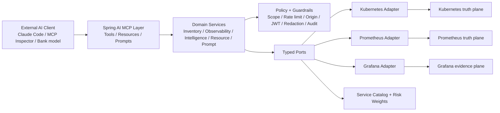

# ProdOps Control Tower MCP

`prodops-control-tower-mcp` is a production-grade, read-only Model Context Protocol server for IDFC FIRST Bank's Production Support Intelligence domain. It turns Kubernetes into the runtime truth plane, Prometheus into the metrics truth plane, and Grafana into the visualization and evidence plane, then exposes that unified operational context to external AI clients over MCP.

This server is intentionally deterministic. It does not embed a chat model and it does not make external LLM calls. Its intelligence comes from weighted scoring, timeline correlation, topology inference, bounded PromQL access, explicit evidence packs, and transparent confidence calculation.

## Why this matters

- Lower MTTR by giving support engineers one MCP endpoint for workload state, metrics, dashboards, and cross-plane reasoning.
- Safer chat-based operations by enforcing a hard read-only contract, policy guardrails, redaction, rate limiting, and scope control.
- Better management visibility by returning both `operator_summary` and `executive_summary` for flagship tools.
- Reusable bank pattern by proving how one MCP server can be productionized with security, observability, CI, deployment manifests, fixtures, and governance.

## Product posture

- Product name: `ProdOps Control Tower MCP`
- Artifact name: `prodops-control-tower-mcp`
- Base package: `com.idfcfirstbank.prodops.controltower.mcp`
- Domain: `Production Support Intelligence`
- Transports: remote HTTP at `/mcp`, optional stdio for local clients
- Runtime: Java 21, Spring Boot 3, Spring AI MCP, Spring MVC
- Upstreams: Kubernetes API, Prometheus HTTP API, Grafana HTTP API
- Mode support: curated service-catalog mode and generic discovery mode
- Safety stance: read-only only, no Secret reads, no mutating upstream actions

## Architecture



## Key capabilities

### Inventory and health

- `list_clusters`
- `list_namespaces`
- `list_workloads`
- `get_namespace_health`
- `get_workload_health`
- `get_pod_diagnostics`
- `get_recent_warning_events`

### Metrics and dashboards

- `run_promql_instant`
- `run_promql_range`
- `search_dashboards`
- `get_dashboard_summary`

### Flagship intelligence

- `correlate_service_incident`
- `estimate_blast_radius`
- `get_change_correlation`
- `forecast_capacity_risk`

Every flagship tool returns structured evidence, confidence, links, limitations, and freshness metadata.

## Repository layout

```text
.
├── config/
├── deploy/
│   ├── helm/
│   └── k8s/
├── docs/
├── examples/
├── fixtures/
├── src/
│   ├── main/
│   └── test/
├── .env.example
├── AGENTS.md
├── bitbucket-pipelines.yml
├── CLAUDE.md
├── Dockerfile
├── Makefile
├── mvnw
├── mvnw.cmd
└── pom.xml
```

## Local prerequisites

- Java 21
- Docker optional, for container packaging
- No live infrastructure is required for fixture mode

## Build and quality checks

```bash
./mvnw -B clean verify
```

Useful narrower commands:

```bash
./mvnw spotless:apply
./mvnw test
./mvnw -DskipTests package
```

## Run in fixture mode over HTTP

```bash
SPRING_PROFILES_ACTIVE=fixture,http \
PRODOPS_BIND_ADDRESS=127.0.0.1 \
PORT=8080 \
MANAGEMENT_PORT=8081 \
./mvnw spring-boot:run
```

MCP endpoint: `http://127.0.0.1:8080/mcp`

Actuator endpoints:

- `http://127.0.0.1:8081/actuator/health`
- `http://127.0.0.1:8081/actuator/prometheus`

## Run in fixture mode over stdio

```bash
SPRING_PROFILES_ACTIVE=fixture,stdio \
./mvnw -DskipTests package

SPRING_PROFILES_ACTIVE=fixture,stdio \
java -jar target/prodops-control-tower-mcp-0.1.0-SNAPSHOT.jar
```

## Fixture demo scenarios

- `scenario_payments_rollout_regression`
- `scenario_upi_recon_saturation`
- `scenario_tradex_alert_storm`

These scenarios are rich enough for incident correlation, change-causality, blast radius, and capacity-risk workflows without contacting any bank system.

## Live-mode configuration

1. Start from [config/config.example.yaml](/Users/rajatyadav/MCP ProdOps/config/config.example.yaml).
2. Add curated services in [config/service-catalog.example.yaml](/Users/rajatyadav/MCP ProdOps/config/service-catalog.example.yaml).
3. Adjust scoring in [config/risk-weights.example.yaml](/Users/rajatyadav/MCP ProdOps/config/risk-weights.example.yaml).
4. Set `SPRING_PROFILES_ACTIVE=live,http`.
5. Provide upstream base URLs and token environment variables.
6. Apply the sample RBAC and network policy from [deploy/k8s](/Users/rajatyadav/MCP ProdOps/deploy/k8s).

Live integrations are read-only only. The server does not pass client tokens downstream.

## Claude Code integration

See [examples/claude_code_setup.md](/Users/rajatyadav/MCP ProdOps/examples/claude_code_setup.md) for stdio and HTTP examples. The short version is:

```json
{
  "mcpServers": {
    "prodops-control-tower-mcp": {
      "command": "java",
      "args": [
        "-jar",
        "/absolute/path/to/target/prodops-control-tower-mcp-0.1.0-SNAPSHOT.jar"
      ],
      "env": {
        "SPRING_PROFILES_ACTIVE": "fixture,stdio"
      }
    }
  }
}
```

## MCP Inspector testing

See [examples/inspector_usage.md](/Users/rajatyadav/MCP ProdOps/examples/inspector_usage.md). A typical local flow is:

```bash
SPRING_PROFILES_ACTIVE=fixture,http ./mvnw spring-boot:run
```

Then connect the inspector to `http://127.0.0.1:8080/mcp`.

## Example questions

- Why is `payments-api` unhealthy in UAT right now?
- Which namespaces show the highest operational risk in the last 60 minutes?
- Did the latest rollout correlate with the latency spike in `upi-recon`?
- What is the likely blast radius if `tradex-gateway` keeps failing?
- Which critical services are closest to SLO risk today?
- Give me a CTO summary of the top five production risks in the last 24 hours.
- Show me the best Grafana dashboard and the relevant evidence for `payments-api`.
- What changed in Kubernetes just before the error rate jumped?

More examples live in [examples/questions.md](/Users/rajatyadav/MCP ProdOps/examples/questions.md) and [docs/demo_script.md](/Users/rajatyadav/MCP ProdOps/docs/demo_script.md).

## Safety summary

- Read-only only
- No exec, rollout, scale, patch, annotate, restart, or dashboard writes
- No Secret reads or credential exposure
- No token passthrough to upstream systems
- Origin validation on HTTP MCP requests
- Optional JWT issuer and audience validation
- Namespace scoping, lookback caps, result caps, and log-line caps
- Redaction of token-like strings and connection-string secrets
- Structured audit logging with argument hashing

The full contract is documented in [docs/read_only_safety.md](/Users/rajatyadav/MCP ProdOps/docs/read_only_safety.md).
