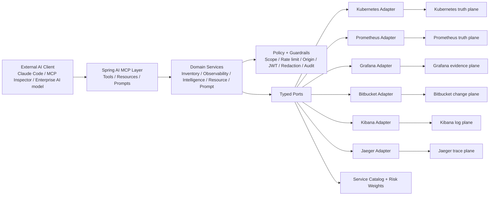

# ProdOps Control Tower MCP

`prodops-control-tower-mcp` is a production-grade, read-only Model Context Protocol server for the Production Support Intelligence domain in enterprise environments. It turns Kubernetes into the runtime truth plane, Prometheus into the metrics truth plane, Grafana into the visualization plane, Bitbucket into the change plane, Kibana into the log plane, and Jaeger into the trace plane, then exposes that unified operational context to external AI clients over MCP.

This server is intentionally deterministic. It does not embed a chat model and it does not make external LLM calls. Its intelligence comes from weighted scoring, timeline correlation, topology inference, bounded PromQL access, explicit evidence packs, and transparent confidence calculation.

## Why this matters

- Lower MTTR by giving support engineers one MCP endpoint for workload state, metrics, dashboards, and cross-plane reasoning.
- Safer chat-based operations by enforcing a hard read-only contract, policy guardrails, redaction, rate limiting, and scope control.
- Better management visibility by returning both `operator_summary` and `executive_summary` for flagship tools.
- Stronger root-cause analysis by explaining what broke, which change is the leading suspect, why it is suspected, what evidence supports or weakens that view, and which alternate suspects remain.
- Reusable enterprise pattern by proving how one MCP server can be productionized with security, observability, CI, deployment manifests, fixtures, and governance.

## Product posture

- Product name: `ProdOps Control Tower MCP`
- Artifact name: `prodops-control-tower-mcp`
- Base package: `com.prodops.controltower.mcp`
- Domain: `Production Support Intelligence`
- Transports: remote HTTP at `/mcp`, optional stdio for local clients
- Runtime: Java 21, Spring Boot 3, Spring AI MCP, Spring MVC
- Upstreams: Kubernetes API, Prometheus HTTP API, Grafana HTTP API, Bitbucket HTTP API, Kibana log search or Elasticsearch-compatible query API, Jaeger HTTP API
- Mode support: curated service-catalog mode and generic discovery mode
- Safety stance: read-only only, no Secret reads, no mutating upstream actions

## Architecture


```mermaid
flowchart LR
    Client["External AI Client\nClaude Code / MCP Inspector / Enterprise AI model"] --> MCP["Spring AI MCP Layer\nTools / Resources / Prompts"]
    MCP --> Services["Domain Services\nInventory / Observability / Intelligence / Resource / Prompt"]
    Services --> Policy["Policy + Guardrails\nScope / Rate limit / Origin / JWT / Redaction / Audit"]
    Services --> Ports["Typed Ports"]
    Ports --> K8s["Kubernetes Adapter"]
    Ports --> Prom["Prometheus Adapter"]
    Ports --> Graf["Grafana Adapter"]
    Ports --> Bitbucket["Bitbucket Adapter"]
    Ports --> Kibana["Kibana Adapter"]
    Ports --> Jaeger["Jaeger Adapter"]
    Ports --> Catalog["Service Catalog + Risk Weights"]
    K8s --> Runtime["Kubernetes truth plane"]
    Prom --> Metrics["Prometheus truth plane"]
    Graf --> Evidence["Grafana evidence plane"]
    Bitbucket --> Changes["Bitbucket change plane"]
    Kibana --> Logs["Kibana log plane"]
    Jaeger --> Traces["Jaeger trace plane"]
```

## Key capabilities

### Inventory and health

- `list_clusters`
- `list_namespaces`
- `list_workloads`
- `get_namespace_health`
- `get_workload_health`
- `get_pod_diagnostics`
- `get_recent_warning_events`
- `check_ingress_health`
- `check_network_policies`
- `security_posture_scan`
- `image_freshness_check`

### Metrics and dashboards

- `run_promql_instant`
- `run_promql_range`
- `search_dashboards`
- `get_dashboard_summary`
- `check_slo_status`
- `slo_breach_forecast`

### Log and trace intelligence

- `search_kibana_logs`
- `summarize_kibana_errors`
- `search_error_patterns`
- `log_anomaly_summary`
- `search_jaeger_traces`
- `get_jaeger_trace_summary`

### Flagship intelligence

- `correlate_service_incident`
- `estimate_blast_radius`
- `get_change_correlation`
- `get_root_cause_analysis`
- `get_change_regression_attribution`
- `compare_change_impact`
- `find_similar_incidents`
- `get_observability_coverage_gaps`
- `forecast_capacity_risk`
- `map_service_dependencies`
- `detect_cascading_failure`
- `compare_pre_post_deploy`
- `rollout_history`
- `canary_health_check`
- `alert_noise_analysis`
- `alert_correlation_groups`
- `identify_resource_waste`
- `right_sizing_recommendations`
- `compare_clusters`
- `cross_cluster_drift`
- `daily_risk_trend`
- `incident_timeline_export`
- `toil_estimation`

Every flagship tool returns structured evidence, confidence, links, limitations, and freshness metadata.

### Prompt packs

- `post_mortem_assistant`
- `runbook_executor_guide`
- `war_room_briefing`
- `weekly_ops_report`

## Repository layout

```text
.
├── config/
├── deploy/
│   ├── helm/
│   └── k8s/
├── docs/
├── examples/
├── fixtures/
├── src/
│   ├── main/
│   └── test/
├── .env.example
├── AGENTS.md
├── bitbucket-pipelines.yml
├── CLAUDE.md
├── Dockerfile
├── Makefile
├── mvnw
├── mvnw.cmd
└── pom.xml
```

## Local prerequisites

- Java 21
- Docker optional, for container packaging
- No live infrastructure is required for fixture mode

## Build and quality checks

```bash
./mvnw -B clean verify
```

Useful narrower commands:

```bash
./mvnw -B -ntp spotless:apply
./mvnw -B -ntp test
./mvnw -B -ntp -DskipTests package
```

## Run in fixture mode over HTTP

```bash
SPRING_PROFILES_ACTIVE=fixture,http \
PRODOPS_BIND_ADDRESS=127.0.0.1 \
PORT=8080 \
MANAGEMENT_PORT=8081 \
./mvnw spring-boot:run
```

MCP endpoint: `http://127.0.0.1:8080/mcp`

Actuator endpoints:

- `http://127.0.0.1:8081/actuator/health`
- `http://127.0.0.1:8081/actuator/prometheus`

## Run in fixture mode over stdio

```bash
SPRING_PROFILES_ACTIVE=fixture,stdio \
./mvnw -DskipTests package

SPRING_PROFILES_ACTIVE=fixture,stdio \
java -jar target/prodops-control-tower-mcp-0.1.0-SNAPSHOT.jar
```

## Fixture demo scenarios

- `scenario_payments_rollout_regression`
- `scenario_upi_recon_saturation`
- `scenario_tradex_alert_storm`
- `scenario_checkout_dependency_regression`
- `scenario_ledger_observability_gap`

These scenarios cover a true change-caused regression, a recent-but-innocent change where a dependency fails first, and a low-confidence case that surfaces observability gaps without over-claiming causality. Additional deterministic root-cause scenarios can be added in fixture mode without changing the tool surface.

## Live-mode configuration

1. Start from [config/config.example.yaml](/Users/rajatyadav/MCP ProdOps/config/config.example.yaml).
2. Add curated services in [config/service-catalog.example.yaml](/Users/rajatyadav/MCP ProdOps/config/service-catalog.example.yaml).
3. Adjust scoring in [config/risk-weights.example.yaml](/Users/rajatyadav/MCP ProdOps/config/risk-weights.example.yaml).
4. Set `SPRING_PROFILES_ACTIVE=live,http`.
5. Provide upstream base URLs and token environment variables for Kubernetes, Prometheus, Grafana, Bitbucket, Kibana, and Jaeger.
6. Apply the sample RBAC and network policy from [deploy/k8s](/Users/rajatyadav/MCP ProdOps/deploy/k8s).

Live integrations are read-only only. The server does not pass client tokens downstream.

## Claude Code integration

See [examples/claude_code_setup.md](/Users/rajatyadav/MCP ProdOps/examples/claude_code_setup.md) for stdio and HTTP examples. The short version is:

```json
{
  "mcpServers": {
    "prodops-control-tower-mcp": {
      "command": "java",
      "args": [
        "-jar",
        "/absolute/path/to/target/prodops-control-tower-mcp-0.1.0-SNAPSHOT.jar"
      ],
      "env": {
        "SPRING_PROFILES_ACTIVE": "fixture,stdio"
      }
    }
  }
}
```

## MCP Inspector testing

See [examples/inspector_usage.md](/Users/rajatyadav/MCP ProdOps/examples/inspector_usage.md). A typical local flow is:

```bash
SPRING_PROFILES_ACTIVE=fixture,http ./mvnw spring-boot:run
```

Then connect the inspector to `http://127.0.0.1:8080/mcp`.

## Example questions

- Why is `payments-api` unhealthy in UAT right now?
- Which namespaces show the highest operational risk in the last 60 minutes?
- Did the latest rollout correlate with the latency spike in `upi-recon`?
- Which Bitbucket change most likely broke `payments-api` in the last 60 minutes?
- Show the top Kibana error signatures for `upi-recon` and correlate them with Jaeger traces.
- Did a recent PR cause the latency spike, or is this a downstream dependency issue?
- Compare the impact before and after commit `XYZ` on `tradex-gateway`.
- Find similar incidents to the current outage.
- Where are our observability blind spots for root cause attribution?
- What is the real-time SLO burn rate and remaining error budget for `payments-api`?
- At the current burn rate, when will `payments-api` breach its availability SLO?
- What depends on `payments-api`, and what does it depend on?
- Is the `tradex-gateway` failure cascading into downstream services?
- Which workloads are wasting the most CPU and memory in `payments-uat`?
- What right-sizing recommendations do you have for `payments-uat` over the last 6 hours?
- Did the latest deploy make `payments-api` better or worse?
- Show the recent rollout history for `payments-api` and correlate revisions with metric shifts.
- Is the canary for `payments-api` healthier or worse than stable?
- Which alerts are mostly noise versus actionable signals in `tradex-edge`?
- Group the last 47 warning alerts into distinct incidents.
- What error patterns are showing up in `payments-api` logs right now?
- Is log volume for `payments-api` anomalous compared with the prior baseline window?
- Are all ingress endpoints in `payments-uat` healthy?
- Is `payments-api` network-isolated or effectively open?
- What is the security posture score for workloads in `payments-uat`?
- Which workloads are running images older than 14 days?
- How does `payments-uat` compare to `payments-prod` right now?
- Is `payments-api` running the same image, revision, and resources in UAT and PROD?
- Is the `payments` namespace getting healthier or worse over the last 6 hours?
- Export the full cross-plane incident timeline for `payments-api`.
- Which namespace or team is carrying the most operational toil this week?
- What is the likely blast radius if `tradex-gateway` keeps failing?
- Which critical services are closest to SLO risk today?
- Give me a CTO summary of the top five production risks in the last 24 hours.
- Show me the best Grafana dashboard and the relevant evidence for `payments-api`.
- What changed in Kubernetes just before the error rate jumped?

More examples live in [examples/questions.md](/Users/rajatyadav/MCP ProdOps/examples/questions.md) and [docs/demo_script.md](/Users/rajatyadav/MCP ProdOps/docs/demo_script.md).

## Safety summary

- Read-only only
- No exec, rollout, scale, patch, annotate, restart, or dashboard writes
- No Secret reads or credential exposure
- No token passthrough to upstream systems
- Origin validation on HTTP MCP requests
- Optional JWT issuer and audience validation
- Namespace scoping, lookback caps, result caps, and log-line caps
- Redaction of token-like strings and connection-string secrets
- Structured audit logging with argument hashing

The full contract is documented in [docs/read_only_safety.md](/Users/rajatyadav/MCP ProdOps/docs/read_only_safety.md).
