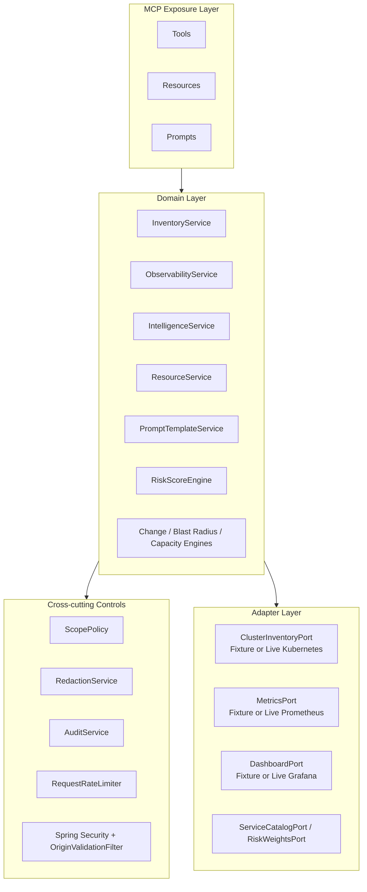
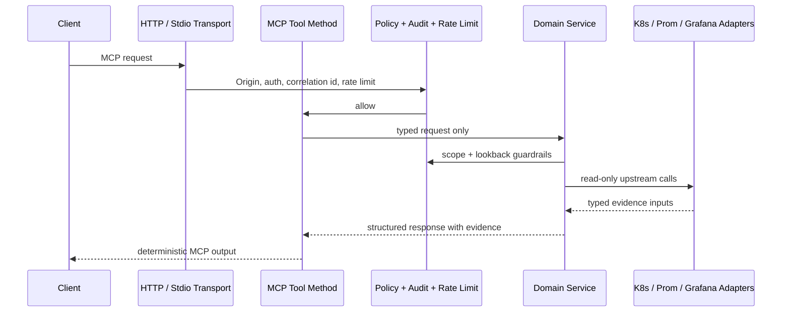
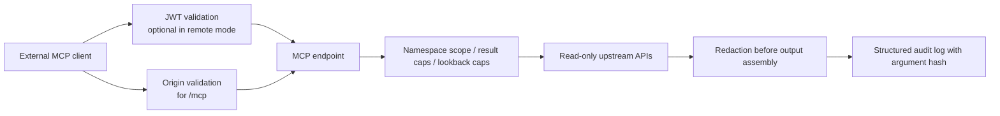

# ProdOps Control Tower MCP Architecture

## Design goals

- One operational control-tower product, not three disconnected wrappers
- Deterministic, auditable reasoning with evidence and confidence
- Strict read-only posture with explicit policy and governance
- Clean separation between MCP exposure, domain services, and upstream adapters

## Component boundaries

## Request flow

## Security boundaries

## Runtime shape

- Primary transport is Spring MVC over stateless HTTP at `/mcp`
- Secondary transport is stdio for local development and local MCP clients
- Actuator remains separate from MCP on port `8081` by default
- Fixture adapters and live adapters are profile-switched and share the same ports-and-adapters contract

## Architectural consequences

- MCP annotations stay thin, so the server is testable without an MCP client
- The same domain services power tools, resources, and prompt templates
- Read-only safety is enforced in code paths, not only in documentation
- Curated and discovery modes coexist without changing the public tool contracts
