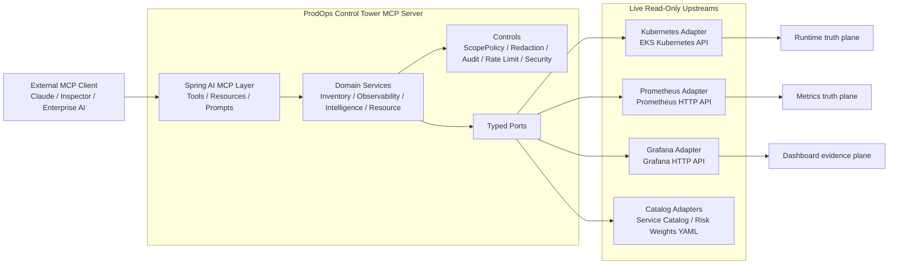
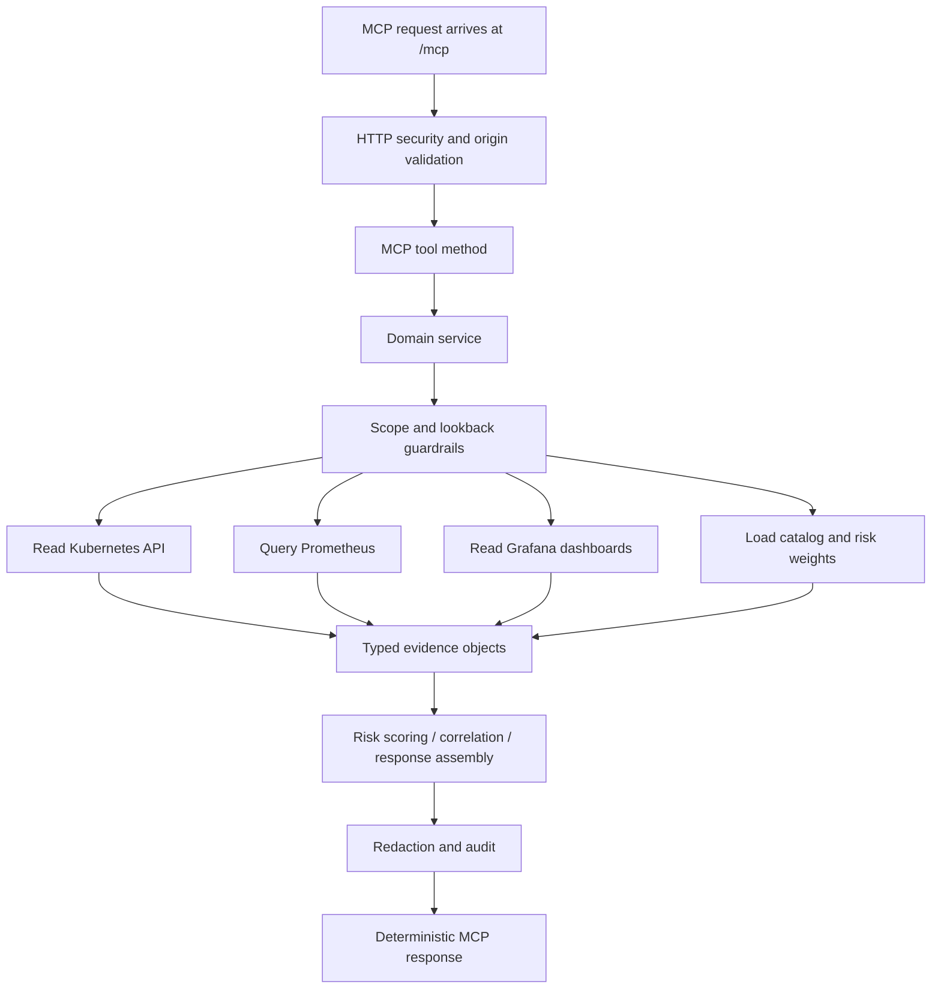
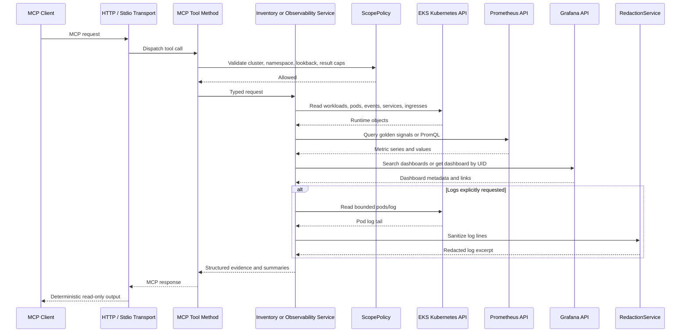
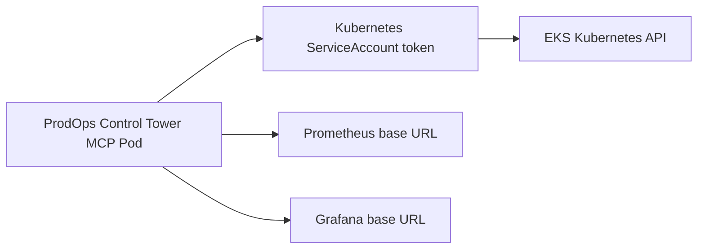

# ProdOps Control Tower MCP EKS Connectivity and Runtime Diagrams

This note explains the current runtime design of `prodops-control-tower-mcp` and how it connects to an Amazon EKS environment in live mode.

## Short answer

- The server connects directly to the Kubernetes API for cluster inventory, workload state, warning events, services, ingresses, HPA, PDB, and bounded pod-log reads.
- The server connects directly to Prometheus for metrics and PromQL execution.
- The server connects directly to Grafana for dashboard search and dashboard metadata retrieval.
- The server does not connect to Kibana in the current implementation.
- The server does not scrape application logs continuously. When logs are requested, it performs an on-demand, bounded read from Kubernetes `pods/log` and then redacts sensitive values before returning the excerpt.

## Source-of-truth mapping

| Upstream | What this server uses it for | What it does not use it for |
| --- | --- | --- |
| Kubernetes API | Namespaces, workloads, pods, events, services, ingresses, HPA, PDB, pod logs | Any mutating action, Secret reads, exec, restart, scale, patch |
| Prometheus | Golden signals, instant PromQL, range PromQL, metric evidence for risk scoring | Dashboard search, log retrieval |
| Grafana | Dashboard search, dashboard summary, panel and variable metadata, deep links | Metric query engine, log collector, dashboard writes |
| Kibana | Not used in the current codebase | Logs, dashboards, search |

## 1. Component-Level Diagram



### Explanation

- The MCP layer stays thin and delegates immediately to domain services.
- Domain services combine evidence from Kubernetes, Prometheus, Grafana, and local catalog data.
- Policy, redaction, audit, and rate limiting are applied around the read path.
- The adapter layer is where all upstream access lives. This is why the server remains read-only and testable.

## 2. Flow Diagram



### Explanation

- Kubernetes contributes runtime topology and operational state.
- Prometheus contributes metric evidence and golden-signal values.
- Grafana contributes human-facing dashboards and panel metadata that act as an evidence plane.
- The server joins those three planes into one structured response instead of exposing them as unrelated wrappers.

## 3. Sequence Diagram

The sequence below shows a typical live request such as `get_workload_health` and the optional log path used by `get_pod_diagnostics(includeLogs=true)`.



### Explanation

- The normal health and intelligence paths use all three live upstream categories: Kubernetes, Prometheus, and Grafana.
- The log path is optional and only happens when a tool asks for logs.
- Even for logs, the server reads a bounded tail and redacts sensitive values before output.

## How the server connects to EKS

There are two supported connection patterns in the current implementation.

### Option 1: Run the server inside EKS

This is the preferred production pattern.



How it works:

1. Deploy the server as a pod inside EKS.
2. Set `prodops.controltower.clusters[].kubernetes.in-cluster: true`.
3. The Java Kubernetes client uses the mounted service-account token and cluster CA to connect with `ClientBuilder.cluster().build()`.
4. The service account is bound to the read-only `ClusterRole` in `deploy/k8s/clusterrole.yaml`.
5. Prometheus and Grafana are reached through their configured base URLs, usually internal service DNS names, internal load balancers, or managed service endpoints reachable from the cluster.

### Option 2: Run the server outside EKS

This is useful for controlled bastion or workstation access.

How it works:

1. Set `prodops.controltower.clusters[].kubernetes.in-cluster: false`.
2. Provide `kubeconfig` and, optionally, `context`.
3. The Java client loads that kubeconfig and connects with `ClientBuilder.kubeconfig(kubeConfig).build()`.
4. Prometheus and Grafana still use their configured base URLs and bearer tokens.

## What each live integration is responsible for

### Kubernetes API and EKS

The EKS connection is the runtime truth plane. This server uses the Kubernetes API directly for:

- namespaces
- deployments, statefulsets, daemonsets, jobs, cronjobs
- pods and owner references
- warning events
- services and ingresses
- HPA and PDB
- bounded `pods/log` reads

This is not a `kubectl` shell-out model. The server uses the Java Kubernetes client directly.

### Prometheus

Prometheus is the metrics truth plane. The server calls the Prometheus HTTP API directly for:

- golden-signal collection used in workload and namespace health
- raw instant PromQL
- raw range PromQL
- metric evidence used by scoring and correlation workflows

This means Grafana is not the source of metrics for the server. Grafana may visualize those metrics, but the server queries Prometheus directly.

### Grafana

Grafana is the evidence and visualization plane. The server calls the Grafana HTTP API directly for:

- dashboard search
- dashboard retrieval by UID
- panel metadata
- dashboard links returned to the AI client

This means Grafana is used for evidence discovery and navigation, not as the primary metric backend.

### Kibana

Kibana is not wired into this server today. There is no Kibana adapter, no Elasticsearch adapter, and no configuration surface for Kibana in the current live profile.

If your organization stores logs only in ELK or OpenSearch, this server will not read those logs unless a new read-only adapter is added.

### Application logs

The server does not scrape logs from applications directly and it does not run an ongoing collector.

Current behavior:

- a client asks for pod diagnostics with logs
- the server reads a bounded tail from Kubernetes `pods/log`
- the server redacts token-like and secret-like values
- the excerpt is returned in the MCP response

So the current log path is direct Kubernetes pod-log access, not Prometheus, not Grafana, and not Kibana.

## Recommended production connectivity for EKS

For a production EKS deployment, the cleanest operating model is:

1. Run `prodops-control-tower-mcp` inside the target EKS environment.
2. Give the pod a dedicated read-only service account and the supplied read-only RBAC.
3. Point the server to a Prometheus endpoint that already scrapes your workloads.
4. Point the server to a Grafana endpoint that already exposes the approved dashboards.
5. Keep network policy egress limited to the Kubernetes API, Prometheus, Grafana, and DNS.

In that model:

- EKS provides runtime state and on-demand pod logs.
- Prometheus provides metrics.
- Grafana provides dashboard evidence.
- Kibana is outside the current design.

## Example live configuration for EKS

```yaml
prodops:
  controltower:
    clusters:
      - name: prodops-uat
        environment: UAT
        enabled: true
        namespace-allowlist:
          - payments-uat
          - upi-ops
        kubernetes:
          in-cluster: true
          kubeconfig: ""
          context: ""
          logs-enabled: true
        prometheus:
          base-url: https://prometheus.uat.example.internal
          bearer-token-ref: PROMETHEUS_BEARER_TOKEN
          timeout: PT30S
        grafana:
          base-url: https://grafana.uat.example.internal
          bearer-token-ref: GRAFANA_BEARER_TOKEN
          default-folder: ProdOps
          timeout: PT30S
```

## Final conclusion

For this server, EKS is not the only upstream, but it is the primary runtime source.

- Use EKS Kubernetes API for runtime inventory and on-demand pod logs.
- Use Prometheus directly for metrics.
- Use Grafana directly for dashboards and evidence.
- Do not expect Kibana integration in the current implementation.
- Do not expect this server to scrape application logs continuously; it reads bounded pod logs only when requested.
