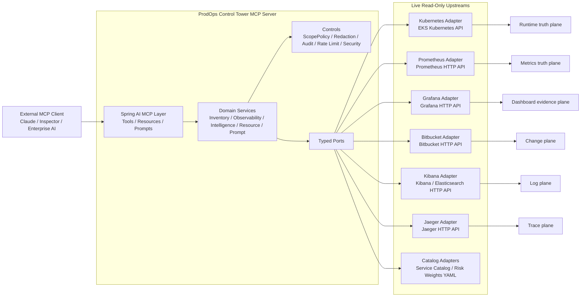
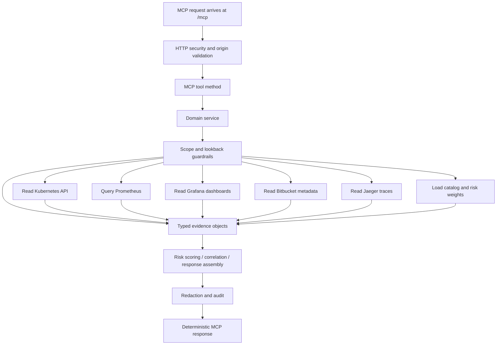
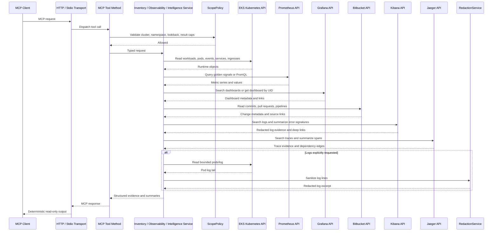
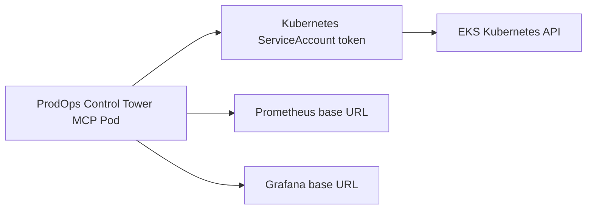

# ProdOps Control Tower MCP EKS Connectivity and Runtime Diagrams

This note explains the current runtime design of `prodops-control-tower-mcp` and how it connects to an Amazon EKS environment in live mode.

## Short answer

- The server connects directly to the Kubernetes API for cluster inventory, workload state, warning events, services, ingresses, HPA, PDB, and bounded pod-log reads.
- The server connects directly to Prometheus for metrics and PromQL execution.
- The server connects directly to Grafana for dashboard search and dashboard metadata retrieval.
- The server connects directly to Bitbucket for commit, pull-request, changed-file, and pipeline metadata.
- The server connects directly to Kibana, or an Elasticsearch-compatible backend behind Kibana, for log search, error summarization, and anomaly detection.
- The server connects directly to Jaeger for trace search, span analysis, dependency edges, and trace summaries.
- The server does not scrape logs continuously. It queries Kibana on demand for log intelligence and can still read bounded Kubernetes `pods/log` tails for pod diagnostics when explicitly requested.

## Source-of-truth mapping

| Upstream | What this server uses it for | What it does not use it for |
| --- | --- | --- |
| Kubernetes API | Namespaces, workloads, pods, events, services, ingresses, HPA, PDB, pod logs | Any mutating action, Secret reads, exec, restart, scale, patch |
| Prometheus | Golden signals, instant PromQL, range PromQL, metric evidence for risk scoring | Dashboard search, log retrieval |
| Grafana | Dashboard search, dashboard summary, panel and variable metadata, deep links | Metric query engine, log collector, dashboard writes |
| Bitbucket | Commits, merged pull requests, changed files, reviewers, pipeline metadata, source links | Any write, merge, comment, trigger, or deployment action |
| Kibana | Log search, error summarization, signature analysis, anomaly detection, deep links | Saved-object writes, alert writes, or mutating ELK actions |
| Jaeger | Trace search, span summaries, failing-span analysis, dependency edges, deep links | Any trace mutation or external analytics write |

## 1. Component-Level Diagram


```mermaid
flowchart LR
    Client["External MCP Client<br/>Claude / Inspector / Enterprise AI"] --> MCP["Spring AI MCP Layer<br/>Tools / Resources / Prompts"]

    subgraph Server["ProdOps Control Tower MCP Server"]
      MCP --> Domain["Domain Services<br/>Inventory / Observability / Intelligence / Resource / Prompt"]
      Domain --> Controls["Controls<br/>ScopePolicy / Redaction / Audit / Rate Limit / Security"]
      Domain --> Ports["Typed Ports"]
    end

    subgraph Upstreams["Live Read-Only Upstreams"]
      Ports --> K8s["Kubernetes Adapter<br/>EKS Kubernetes API"]
      Ports --> Prom["Prometheus Adapter<br/>Prometheus HTTP API"]
      Ports --> Graf["Grafana Adapter<br/>Grafana HTTP API"]
      Ports --> Bitbucket["Bitbucket Adapter<br/>Bitbucket HTTP API"]
      Ports --> Kibana["Kibana Adapter<br/>Kibana / Elasticsearch HTTP API"]
      Ports --> Jaeger["Jaeger Adapter<br/>Jaeger HTTP API"]
      Ports --> Catalog["Catalog Adapters<br/>Service Catalog / Risk Weights YAML"]
    end

    K8s --> Runtime["Runtime truth plane"]
    Prom --> Metrics["Metrics truth plane"]
    Graf --> Evidence["Dashboard evidence plane"]
    Bitbucket --> Changes["Change plane"]
    Kibana --> Logs["Log plane"]
    Jaeger --> Traces["Trace plane"]
```

### Explanation

- The MCP layer stays thin and delegates immediately to domain services.
- Domain services combine evidence from Kubernetes, Prometheus, Grafana, Bitbucket, Kibana, Jaeger, and local catalog data.
- Policy, redaction, audit, and rate limiting are applied around the read path.
- The adapter layer is where all upstream access lives. This is why the server remains read-only and testable.

## 2. Flow Diagram


```mermaid
flowchart TD
    A["MCP request arrives at /mcp"] --> B["HTTP security and origin validation"]
    B --> C["MCP tool method"]
    C --> D["Domain service"]
    D --> E["Scope and lookback guardrails"]
    E --> F["Read Kubernetes API"]
    E --> G["Query Prometheus"]
    E --> H["Read Grafana dashboards"]
    E --> I["Read Bitbucket metadata"]
    E --> J["Search Kibana logs"]
    E --> K["Read Jaeger traces"]
    E --> L["Load catalog and risk weights"]
    F --> J["Typed evidence objects"]
    G --> J
    H --> J
    I --> J
    K --> J
    L --> J
    J --> M["Risk scoring / correlation / response assembly"]
    M --> N["Redaction and audit"]
    N --> O["Deterministic MCP response"]
```

### Explanation

- Kubernetes contributes runtime topology and operational state.
- Prometheus contributes metric evidence and golden-signal values.
- Grafana contributes human-facing dashboards and panel metadata that act as an evidence plane.
- Bitbucket contributes recent code and pipeline context.
- Kibana contributes redacted log evidence and signature summaries.
- Jaeger contributes trace failures, critical-path data, and dependency edges.
- The server joins those planes into one structured response instead of exposing them as unrelated wrappers.

## 3. Sequence Diagram

The sequence below shows a typical live request such as `get_root_cause_analysis` and the optional pod-log path used by `get_pod_diagnostics(includeLogs=true)`.


```mermaid
sequenceDiagram
    participant Client as MCP Client
    participant Http as HTTP / Stdio Transport
    participant Tool as MCP Tool Method
    participant Domain as Inventory / Observability / Intelligence Service
    participant Policy as ScopePolicy
    participant K8s as EKS Kubernetes API
    participant Prom as Prometheus API
    participant Graf as Grafana API
    participant Change as Bitbucket API
    participant Logs as Kibana API
    participant Trace as Jaeger API
    participant Redaction as RedactionService

    Client->>Http: MCP request
    Http->>Tool: Dispatch tool call
    Tool->>Policy: Validate cluster, namespace, lookback, result caps
    Policy-->>Tool: Allowed
    Tool->>Domain: Typed request
    Domain->>K8s: Read workloads, pods, events, services, ingresses
    K8s-->>Domain: Runtime objects
    Domain->>Prom: Query golden signals or PromQL
    Prom-->>Domain: Metric series and values
    Domain->>Graf: Search dashboards or get dashboard by UID
    Graf-->>Domain: Dashboard metadata and links
    Domain->>Change: Read commits, pull requests, pipelines
    Change-->>Domain: Change metadata and source links
    Domain->>Logs: Search logs and summarize error signatures
    Logs-->>Domain: Redacted log evidence and deep links
    Domain->>Trace: Search traces and summarize spans
    Trace-->>Domain: Trace evidence and dependency edges
    alt Logs explicitly requested
      Domain->>K8s: Read bounded pods/log
      K8s-->>Domain: Pod log tail
      Domain->>Redaction: Sanitize log lines
      Redaction-->>Domain: Redacted log excerpt
    end
    Domain-->>Tool: Structured evidence and summaries
    Tool-->>Http: MCP response
    Http-->>Client: Deterministic read-only output
```

### Explanation

- The normal health and intelligence paths use Kubernetes, Prometheus, Grafana, Bitbucket, Kibana, and Jaeger as needed.
- The pod-log path is optional and only happens when a tool explicitly asks for container logs.
- Kibana is the primary live log intelligence path. Kubernetes pod logs remain a bounded fallback for pod diagnostics.

## How the server connects to EKS

There are two supported connection patterns in the current implementation.

### Option 1: Run the server inside EKS

This is the preferred production pattern.


```mermaid
flowchart LR
    Pod["ProdOps Control Tower MCP Pod"] --> SA["Kubernetes ServiceAccount token"]
    SA --> APIServer["EKS Kubernetes API"]
    Pod --> PromURL["Prometheus base URL"]
    Pod --> GrafURL["Grafana base URL"]
```

How it works:

1. Deploy the server as a pod inside EKS.
2. Set `prodops.controltower.clusters[].kubernetes.in-cluster: true`.
3. The Java Kubernetes client uses the mounted service-account token and cluster CA to connect with `ClientBuilder.cluster().build()`.
4. The service account is bound to the read-only `ClusterRole` in `deploy/k8s/clusterrole.yaml`.
5. Prometheus, Grafana, Bitbucket, Kibana, and Jaeger are reached through their configured base URLs, usually internal service DNS names, internal load balancers, or approved managed-service endpoints reachable from the cluster.

### Option 2: Run the server outside EKS

This is useful for controlled bastion or workstation access.

How it works:

1. Set `prodops.controltower.clusters[].kubernetes.in-cluster: false`.
2. Provide `kubeconfig` and, optionally, `context`.
3. The Java client loads that kubeconfig and connects with `ClientBuilder.kubeconfig(kubeConfig).build()`.
4. Prometheus, Grafana, Bitbucket, Kibana, and Jaeger still use their configured base URLs and bearer tokens.

## What each live integration is responsible for

### Kubernetes API and EKS

The EKS connection is the runtime truth plane. This server uses the Kubernetes API directly for:

- namespaces
- deployments, statefulsets, daemonsets, jobs, cronjobs
- pods and owner references
- warning events
- services and ingresses
- HPA and PDB
- bounded `pods/log` reads

This is not a `kubectl` shell-out model. The server uses the Java Kubernetes client directly.

### Prometheus

Prometheus is the metrics truth plane. The server calls the Prometheus HTTP API directly for:

- golden-signal collection used in workload and namespace health
- raw instant PromQL
- raw range PromQL
- metric evidence used by scoring and correlation workflows

This means Grafana is not the source of metrics for the server. Grafana may visualize those metrics, but the server queries Prometheus directly.

### Grafana

Grafana is the evidence and visualization plane. The server calls the Grafana HTTP API directly for:

- dashboard search
- dashboard retrieval by UID
- panel metadata
- dashboard links returned to the AI client

This means Grafana is used for evidence discovery and navigation, not as the primary metric backend.

### Bitbucket

Bitbucket is the change plane. The server calls the Bitbucket HTTP API directly for:

- recent commits
- merged pull requests
- changed files and reviewers
- branch and merge timing
- pipeline metadata and source links

This means change regression attribution is based on upstream change metadata, not guessed from Kubernetes state alone.

### Kibana

Kibana is the log intelligence plane. The server calls the Kibana API, or an Elasticsearch-compatible API configured behind it, for:

- scoped log search
- dominant error-signature summaries
- recurring error-pattern detection
- deterministic log-volume anomaly summaries
- deep links back to Discover

This means live log analysis is no longer limited to direct pod-log tails.

### Application logs

The server does not scrape logs from applications directly and it does not run an ongoing collector.

Current behavior:

- for cross-service log intelligence, the server queries Kibana on demand
- for pod-specific troubleshooting, a client can still ask for pod diagnostics with logs
- the server then reads a bounded tail from Kubernetes `pods/log`
- the server redacts token-like and secret-like values before returning the excerpt

So the current live log story is Kibana-first, with bounded Kubernetes pod-log access as a targeted fallback.

### Jaeger

Jaeger is the trace intelligence plane. The server calls the Jaeger HTTP API directly for:

- trace search by service, operation, error state, or trace id
- span summaries and first-failing-span detection
- critical-path and latency-hotspot analysis
- dependency-edge extraction
- deep links back to traces

## Recommended production connectivity for EKS

For a production EKS deployment, the cleanest operating model is:

1. Run `prodops-control-tower-mcp` inside the target EKS environment.
2. Give the pod a dedicated read-only service account and the supplied read-only RBAC.
3. Point the server to a Prometheus endpoint that already scrapes your workloads.
4. Point the server to a Grafana endpoint that already exposes the approved dashboards.
5. Point the server to approved Bitbucket, Kibana, and Jaeger endpoints.
6. Keep network-policy egress limited to the Kubernetes API, Prometheus, Grafana, Bitbucket, Kibana or Elasticsearch, Jaeger, and DNS.

In that model:

- EKS provides runtime state and on-demand pod logs.
- Prometheus provides metrics.
- Grafana provides dashboard evidence.
- Bitbucket provides change evidence.
- Kibana provides log evidence.
- Jaeger provides trace evidence.

## Example live configuration for EKS

```yaml
prodops:
  controltower:
    clusters:
      - name: prodops-uat
        environment: UAT
        enabled: true
        namespace-allowlist:
          - payments-uat
          - upi-ops
        kubernetes:
          in-cluster: true
          kubeconfig: ""
          context: ""
          logs-enabled: true
        prometheus:
          base-url: https://prometheus.uat.example.internal
          bearer-token-ref: PROMETHEUS_BEARER_TOKEN
          timeout: PT30S
        grafana:
          base-url: https://grafana.uat.example.internal
          bearer-token-ref: GRAFANA_BEARER_TOKEN
          default-folder: ProdOps
          timeout: PT30S
        bitbucket:
          base-url: https://bitbucket.example.internal
          bearer-token-ref: BITBUCKET_BEARER_TOKEN
          workspace: prodops
          project-key: PRODOPS
          repo-slug: payments-api
          browse-base-url: https://bitbucket.example.internal/projects/PRODOPS/repos/payments-api
          timeout: PT30S
        kibana:
          base-url: https://kibana.example.internal
          bearer-token-ref: KIBANA_BEARER_TOKEN
          default-data-view: prodops-logs
          elasticsearch-base-url: https://elasticsearch.example.internal
          discover-path: /app/discover
          timeout: PT30S
        jaeger:
          base-url: https://jaeger.example.internal
          bearer-token-ref: JAEGER_BEARER_TOKEN
          timeout: PT30S
```

## Final conclusion

For this server, EKS is not the only upstream, but it is the primary runtime source.

- Use EKS Kubernetes API for runtime inventory and on-demand pod logs.
- Use Prometheus directly for metrics.
- Use Grafana directly for dashboards and evidence.
- Use Bitbucket directly for change metadata and pipeline evidence.
- Use Kibana directly for live log intelligence, with bounded pod logs as a fallback.
- Use Jaeger directly for trace intelligence.
- Do not expect this server to scrape application logs continuously; it performs bounded, on-demand reads only.
